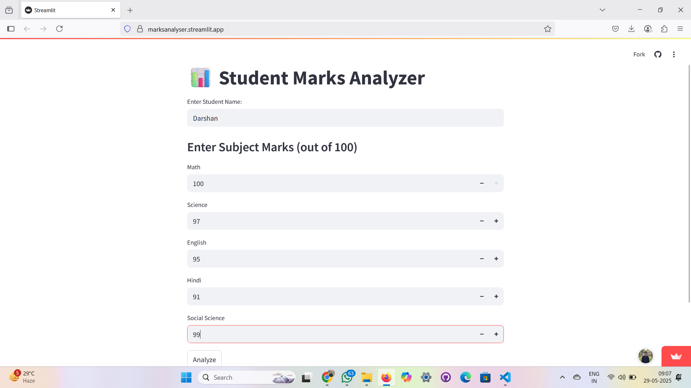
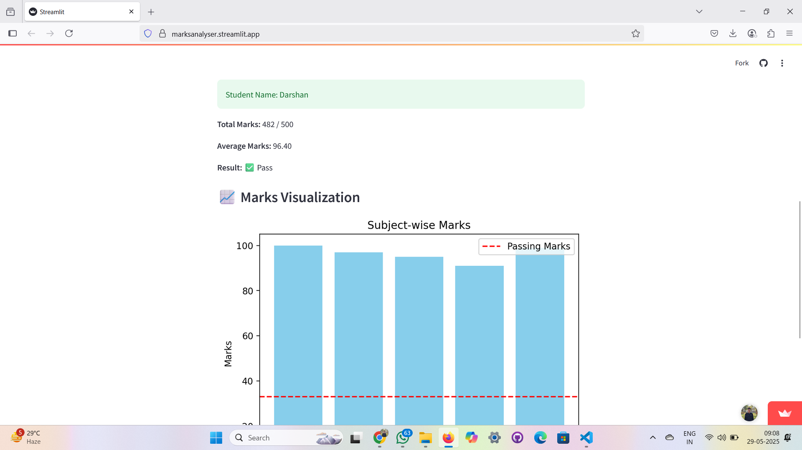
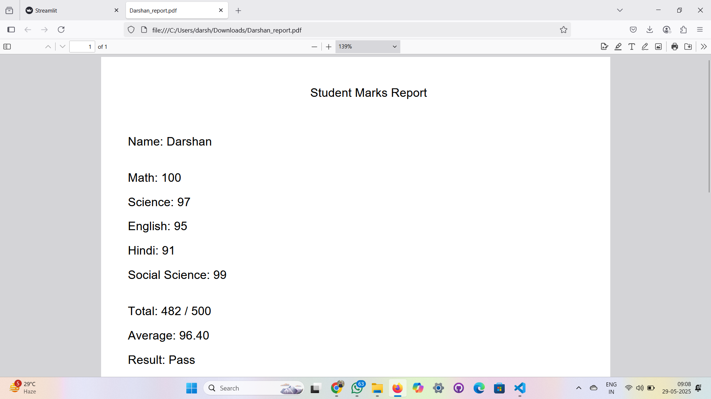

# 📊 Student Marks Analyzer – Analyze, Visualize, & Export 📈✨


> A smart and interactive web app that lets you enter, analyze, visualize, and export student marks 📚🎓 — all in one place!

---

## 🚀 Live Demo

🎯 **Try it out now** 👉 [marksanalyser.streamlit.app](https://marksanalyser.streamlit.app/)

---

## 🌟 Features

- ✅ Clean and minimal UI with 🎯 real-time analysis
- 📥 Marks input for 5 core subjects
- 📊 Subject-wise bar graph visualization with pass line indicator
- 🧮 Auto calculation of total, average & result
- 📄 Generate and download professional **PDF reports**
- 💡 100% beginner-friendly & open-source

---

## 🧰 Tech Stack

| Tool        | Description                        |
|-------------|------------------------------------|
| 🐍 Python   | Core logic & computation engine     |
| 🧼 Streamlit | App UI framework                   |
| 📊 Matplotlib | Graph generation & visualization  |
| 📄 ReportLab | PDF generation module              |

---

## 🖼️ Screenshots

### 🔹 Input Section – Enter Student Details & Marks


### 🔹 Analysis Output – Visual Stats & Pass Result


### 🔹 PDF Export – Clean Printable Report



---

## ⚙️ Installation & Run Locally

```bash
# 1. Clone the repository
git clone https://github.com/DarshanAjudiya7/streamlit-app.git
cd streamlit-app

# 2. Install required libraries
pip install -r requirements.txt

# 3. Run the app
streamlit run app.py
````

---

## 🎯 Use Cases

* 💻 Academic project showcase
* 📖 School/college internal tools
* 📈 Teachers’ digital mark register
* 🧪 ML/DS educational demos

---

## 🤝 Contribute

Contributions are warmly welcome! 🌍
Just fork 🍴 → code ✍️ → pull request 🔃 → merge ✅

---

## 📄 License

This project is licensed under the **MIT License** 🧾
Feel free to use, modify, and share 💙

---

## 👨‍💻 Author

Made with 💙 by **Darshan Ajudiya**
🔗 [GitHub Profile](https://github.com/DarshanAjudiya7)

---

> ✨ *“Simplify marks analysis. Visualize success. One click at a time.”* 📚📊


